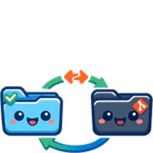

# Devtools

## Tool maturity
| Maturity | Classification | Meaning |
| --- | --- | --- |
| 🌱 | `seed` | just testing, might not work |
| 🪴 | `sprout` | has seen some use, might still have hardcoded assumptions and not generalized |
| 🌳 | `oak` | battle tested. good for general usage |

A bunch of useful tools. Designed by human. Made by codex.

## CLI index

- 🌳 `oak`: [tokemon](docs/tokemon/usage.md) ; entry point `bin/tokemon`; report token usage from local Codex and Claude session logs, including the data backend used by the Tokemon menu app
- 🌳 `oak`: [jsonlint](docs/jsonlint/usage.md) ; entry point `bin/jsonlint`; validate JSON from a file path or stdin
- 🌳 `oak`: [mdpaste](docs/mdpaste/usage.md) ; entry point `bin/mdpaste`; convert Markdown in the clipboard into rich text for paste targets like Gmail and Google Docs
- 🌳 `oak`: [mdpreview](docs/mdpreview/usage.md) ; entry point `bin/mdpreview`; render Markdown from stdin or a file into a localhost preview page with markdown-it plugins
- 🌳 `oak`: [fishy](docs/fishy/usage.md) ; entry point `bin/fishy`; serve a local Mermaid preview from stdin or a file path
- 🪴 `sprout`: [arbor](docs/arbor/usage.md) ; entry point `bin/arbor`; manage git branches/worktrees with merged cleanup, multi-target removal, branch-to-worktree and worktree-to-main conversion, and force-with-lease pushing
- 🪴 `sprout`: [diff](docs/diff/usage.md) ; entry point `bin/diff`; show a git diff from the current working tree against the most recent commit at or before a relative cutoff, with optional `--name-only`
- 🪴 `sprout`: [tokemon-menuapp](docs/tokemon-menuapp/usage.md) ; entry point `bin/tokemon-menuapp`; build and launch the native Tokemon macOS menu-bar app
- 🌱 `seed`: [agent-sync](docs/agent-sync/usage.md) ; entry point `bin/agent-sync`; bidirectionally sync selected agent-config files between a live folder and a git repo with file-level conflict detection and dry-run preview
- 🌱 `seed`: [autocrop-video](docs/autocrop-video/usage.md) ; entry point `bin/autocrop-video`; detect the embedded video frame inside a larger screen recording and optionally crop the file to that box
- 🌱 `seed`: [ag-man](docs/ag-man/usage.md) ; entry point `bin/ag-man`; list today's `ag-ledger` session starts as JSONL with active/inactive process and tmux status, with optional `--filter key=value` and `--group-by workspace`
- 🌱 `seed`: [convo](docs/convo/usage.md) ; entry point `bin/convo`; search Codex conversation logs with fast regex matching and optional date-window filtering
- 🌱 `seed`: [sshx](docs/sshx/usage.md) ; entry point `bin/sshx`; sync a conservative set of local dotfiles to a remote host with rsync, then open ssh with optional identity and SSH options

## Docs layout

- `docs/[tool-name]/usage.md`: CLI usage docs
- `docs/[tool-name]/spec.md`: tool design/architecture spec
