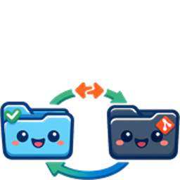

# Devtools

## Tool maturity
| Maturity | Classification | Meaning |
| --- | --- | --- |
| 🌱 | `seed` | just testing, might not work |
| 🪴 | `sprout` | has seen some use, might still have hardcoded assumptions and not generalized |
| 🌳 | `oak` | battle tested. good for general usage |

A bunch of useful tools. Designed by human. Made by codex.

## CLI index

- 🌱 `seed`: [gitsync](tools/gitsync/README.md); entry point `tools/gitsync/bin/gitsync`; inspect fetch/worktree status and safely synchronize cron-scheduled Git repositories with optional post-sync hooks using launchd
- 🌳 `oak`: [tokemon](tools/tokemon/README.md) ; entry point `tools/tokemon/bin/tokemon`; report token usage from local Codex and Claude session logs, including the data backend used by the Tokemon menu app
- 🌳 `oak`: [jsonlint](tools/jsonlint/README.md) ; entry point `tools/jsonlint/bin/jsonlint`; validate JSON from a file path or stdin
- 🌳 `oak`: [mdpaste](tools/mdpaste/README.md) ; entry point `tools/mdpaste/bin/mdpaste`; convert Markdown in the clipboard into rich text for paste targets like Gmail and Google Docs
- 🌳 `oak`: [mdpreview](tools/mdpreview/README.md) ; entry point `tools/mdpreview/bin/mdpreview`; render Markdown from stdin or a file into a localhost preview page with markdown-it plugins
- 🌳 `oak`: [fishy](tools/fishy/README.md) ; entry point `tools/fishy/bin/fishy`; open an editable Mermaid playground or serve previews from stdin, a Mermaid file, or Markdown source blocks
- 🪴 `sprout`: [cozy](tools/cozy/README.md); entry point `tools/cozy/bin/cozy`; manage localhost services from a cute admin dashboard with live refresh, per-site restart, and add-service controls
- 🪴 `sprout`: [arbor](tools/arbor/README.md) ; entry point `tools/arbor/bin/arbor`; manage git branches/worktrees with merged cleanup, multi-target removal, branch-to-worktree and worktree-to-main conversion, and force-with-lease pushing
- 🪴 `sprout`: [diff](tools/diff/README.md) ; entry point `tools/diff/bin/diff`; show a git diff from the current working tree against the most recent commit at or before a relative cutoff, with optional `--name-only`
- 🪴 `sprout`: [tokemon-menuapp](apps/tokemon-menuapp/README.md) ; entry point `apps/tokemon-menuapp/bin/tokemon-menuapp`; build and launch the native Tokemon macOS menu-bar app
- 🌱 `seed`: [agent-sync](tools/agent-sync/README.md) ; entry point `tools/agent-sync/bin/agent-sync`; bidirectionally sync selected agent-config files between a live folder and a git repo with file-level conflict detection and dry-run preview
- 🌱 `seed`: [autocrop-video](tools/autocrop-video/README.md) ; entry point `tools/autocrop-video/bin/autocrop-video`; detect the embedded video frame inside a larger screen recording and optionally crop the file to that box
- 🌱 `seed`: [codex-tmux](tools/codex-tmux/README.md); entry point `tools/codex-tmux/bin/codex-tmux`; inventory tmux panes with running Codex processes and infer their visible state
- 🌱 `seed`: [ag-man](tools/ag-man/README.md) ; entry point `tools/ag-man/bin/ag-man`; list today's `ag-ledger` session starts as JSONL with active/inactive process and tmux status, with optional `--filter key=value` and `--group-by workspace`
- 🌱 `seed`: [claw-debug](tools/claw-debug/README.md); entry point `tools/claw-debug/bin/claw-debug`; dump local OpenClaw session debug files for one session key
- 🌱 `seed`: [convo](tools/convo/README.md) ; entry point `tools/convo/bin/convo`; search Codex conversation logs with fast regex matching and optional date-window filtering
- 🌱 `seed`: [epoch](tools/epoch/README.md); entry point `tools/epoch/bin/epoch`; convert an epoch timestamp into UTC, local, and relative time
- 🌱 `seed`: [jwtio](tools/jwtio/README.md); entry point `tools/jwtio/bin/jwtio`; decode a JWT from stdin into pretty JSON showing the header, payload, and signature fields
- 🌱 `seed`: [slack-post](tools/slack-post/README.md); entry point `tools/slack-post/bin/slack-post`; post a plain-text message to a Slack channel with a provided token
- 🌱 `seed`: [sshx](tools/sshx/README.md) ; entry point `tools/sshx/bin/sshx`; sync configured profile-selected local dotfiles plus Codex CLI config, agents, hooks, rules, and skills to a remote host with rsync or tar-over-ssh fallback, then open ssh with optional identity and SSH options

## Local apps and extensions

- 🌱 `seed`: [ctrl-tab-chrome](apps/ctrl-tab-chrome/README.md); app path `apps/ctrl-tab-chrome`; local Chrome extension that makes `Ctrl+Tab` switch to the last used tab on normal web pages

## Projects in planning

- [beethoven](tools/beethoven/README.md)
- [configsync](tools/configsync/README.md)

## Project layout

```text
tools/<project>/ or apps/<project>/
  README.md
  AGENTS.md  # Only when the project needs agent-specific instructions.
  bin/
  docs/
  playbooks/
  specs/
  src/
```

Project directories contain only the optional subdirectories they actually
need. The root `bin/` directory retains compatibility symlinks for the
existing shell `PATH`, LaunchAgents, and shared test suite.

Runtime configuration lives outside the repository under
`~/.config/<tool>/` or `~/.config/<application>/`. Its portable chezmoi source
lives in `~/agents/config/`, which synchronizes managed settings into the home
directory. Source and build manifests, including `package.json`,
`tsconfig.json`, and Chrome extension `manifest.json`, remain in their projects
because they describe the implementation rather than machine-local settings.
