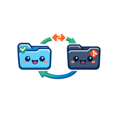

# `agent-sync` usage

<div align="center"></div>

`agent-sync` is a small Python CLI for syncing a selected subset of files between:

- a live agent config folder on a machine
- a dedicated local git clone
- a shared remote git repo

It is intentionally conservative:

- it only syncs files you list in the config
- it keeps per-machine sync state in a local JSON file
- it auto-merges non-overlapping file changes
- it stops on same-file conflicts unless you rerun with `--force source` or `--force repo`
- it supports `--dry-run` previews without changing the live folder, repo clone, remote, or state file

## Model

Each machine runs the same flow:

1. Pull latest changes into the local sync repo with `git pull --rebase`.
2. Snapshot the tracked files in the live folder and in the repo clone.
3. Compare both snapshots against the last synced snapshot from the local state file.
4. Copy local-only changes into the repo clone, commit, and push.
5. Copy repo-only changes back into the live folder.
6. Save the new synced snapshot locally.

This gives you:

`computer A live config <-> computer A repo clone <-> remote git <-> computer B repo clone <-> computer B live config`

## Config file

Use a JSON config file. Example:

```json
{
  "profile": "codex-config",
  "source_dir": "/Users/kevin/.codex",
  "repo_dir": "/Users/kevin/src/agent-config-sync",
  "paths": [
    "config.toml",
    "skills",
    "prompts"
  ],
  "exclude": [
    "sessions/**",
    "logs/**"
  ],
  "state_file": "/Users/kevin/.cache/agent-sync/codex-config.json",
  "remote": "origin",
  "branch": "main",
  "bootstrap": "source",
  "commit_message": "agent-sync: update codex config",
  "git_author_name": "Agent Sync",
  "git_author_email": "agent-sync@example.com"
}
```

## Setup

1. Create a dedicated git repo for the synced config files.
2. Clone it locally on each computer.
3. Run `agent-sync init` inside the repo clone to create `./agent-sync.json`.
4. Use `bootstrap: "source"` on the machine whose live config should seed the repo.
5. Use `bootstrap: "repo"` on the next machine so it pulls from git into the empty local folder.

After the first successful run, `bootstrap` is ignored unless you delete the state file.

## Commands

Bootstrap a Codex-flavored config file in the current directory:

```bash
python bin/agent-sync init
```

This writes `./agent-sync.json` with these defaults:

- `source_dir`: `~/.codex`
- `repo_dir`: the current directory
- `paths`: `AGENTS.md`, `agents`, `automations`, `config.toml`, `memories`, `rules`, `skills`
- `bootstrap`: `source`

On a fresh second machine, change `bootstrap` to `repo` before the first sync run.

Run a normal sync:

```bash
python bin/agent-sync /path/to/agent-sync.json
```

Preview a sync without changing anything:

```bash
python bin/agent-sync --dry-run /path/to/agent-sync.json
```

`--dry-run` is side-effect free:

- it does not copy files in either direction
- it does not write the state file
- it does not switch branches, pull, commit, or push
- it evaluates against the repo clone's current checked-out branch, which must already match the configured branch

Resolve a same-file conflict by choosing the live folder for this run:

```bash
python bin/agent-sync --force source /path/to/agent-sync.json
```

Resolve a same-file conflict by choosing the repo version for this run:

```bash
python bin/agent-sync --force repo /path/to/agent-sync.json
```

The CLI prints a JSON summary including:

- `source_to_repo`: files copied from the live folder into the repo clone
- `repo_to_source`: files copied from the repo clone into the live folder
- `commit`: final repo commit
- `pushed`: whether the run created and pushed a commit

## Recommended operating model

- Use a dedicated repo clone only for sync. Do not edit it by hand.
- Track only durable config, prompts, skills, and scripts.
- Exclude logs, caches, session transcripts, SQLite files, and generated artifacts.
- Run the command manually, via cron, or through `launchd`.

## Failure modes

- Dirty repo clone: the tool exits and tells you to clean the repo clone first.
- Same-file conflict: the tool exits with code `1` and lists the conflicting paths.
- Push race: rerun the command. The tool pulls with rebase on each run, so a clean rerun is the recovery path.
