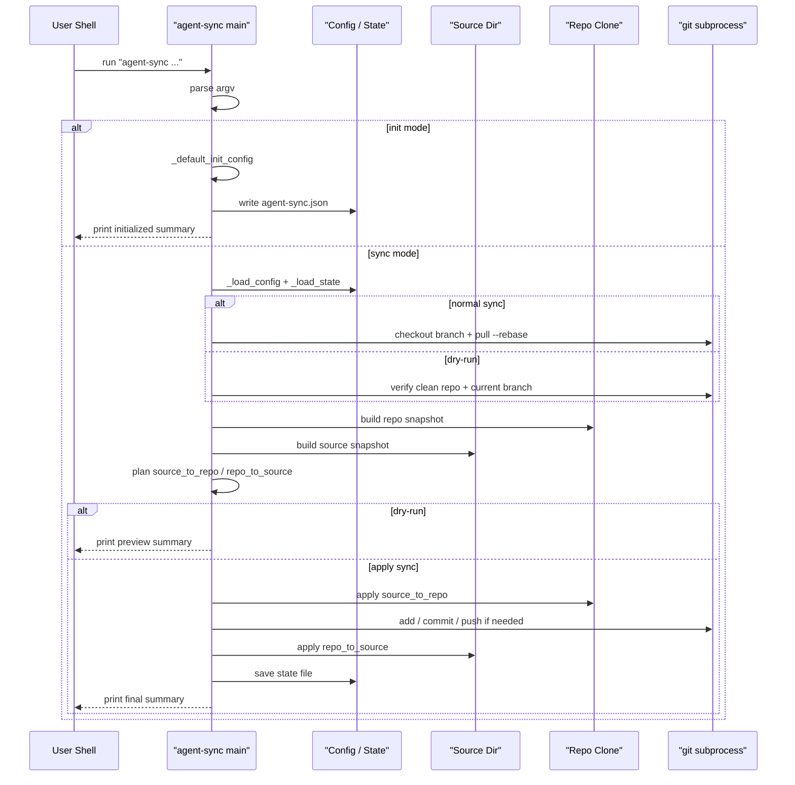

# Agent Sync Flow

Last updated: 2026-03-08

## Purpose / Question Answered

This doc explains how `agent-sync` moves from CLI arguments to either a generated config file (`init`) or a planned/applied bidirectional sync (`sync`). It answers the main debugging questions for the tool: which branch is taken, when git is touched, how the state file participates in conflict detection, and where dry-run stops side effects.

## Entry points

- `bin/agent-sync`: `main` dispatches between `init` and sync mode, translates exceptions into exit codes, and prints the final JSON summary.
- `bin/agent-sync`: `_init_config` materializes a default Codex-oriented JSON config in the current directory.
- `bin/agent-sync`: `_sync` performs repo preparation, snapshot collection, sync planning, optional application, and summary generation.

## Call path

### Phase 1: Parse CLI and choose mode

Trigger / entry condition:
- A user runs `python bin/agent-sync ...` from a shell.

Entrypoints:
- `bin/agent-sync:main`
- `bin/agent-sync:_parse_init_args`
- `bin/agent-sync:_parse_sync_args`

Ordered call path:
- `main` normalizes `argv` from `sys.argv[1:]` when no explicit argument list is passed.
- If `argv[0] == "init"`, `main` parses init-specific args and routes to `_init_config`.
- Otherwise `main` parses sync args, resolves the config path, loads `SyncConfig` via `_load_config`, and routes to `_sync`.
- `main` wraps both branches in exception handling: `SyncConflictError` maps to exit code `1`, `SyncError` maps to exit code `2`, and success prints JSON with exit code `0`.

State transitions / outputs:
- Input: raw CLI arguments.
- Output: either parsed init args, or a validated `SyncConfig` plus sync control flags (`force`, `dry_run`).

Branch points:
- `argv[0] == "init"` selects config-generation mode instead of sync mode.
- `--force` in sync mode changes conflict resolution behavior.
- `--dry-run` in sync mode keeps the execution path side-effect free after planning.

External boundaries:
- None identified in this phase.

#### Sudocode (Phase 1: Parse CLI and choose mode)

```ts
// Source: bin/agent-sync
argv := list(sys.argv[1:] if argv is None else argv)

try
  if argv and argv[0] == "init"
    args := _parse_init_args(argv[1:])
    summary := _init_config(Path(args.config).expanduser().resolve(), overwrite=args.force)
  else
    args := _parse_sync_args(argv)
    config := _load_config(Path(args.config).expanduser().resolve())
    summary := _sync(config, force=args.force, dry_run=args.dry_run)
except SyncConflictError as exc
  print error and each conflicting path to stderr
  return 1
except SyncError as exc
  print error to stderr
  return 2

print(json.dumps(summary, indent=2, sort_keys=True))
return 0
```

### Phase 2: Generate a default config in `init` mode

Trigger / entry condition:
- Phase 1 selected the `init` branch.

Entrypoints:
- `bin/agent-sync:_init_config`
- `bin/agent-sync:_default_init_config`
- `bin/agent-sync:_sanitize_profile`

Ordered call path:
- `_init_config` rejects the write if the target path already exists and `overwrite` is false.
- `_default_init_config` derives a profile from `Path.cwd().name` and hardcodes Codex-oriented defaults: `source_dir`, `repo_dir`, tracked `paths`, `remote`, `branch`, and `bootstrap`.
- `_init_config` creates parent directories for the output file and writes pretty-printed JSON.
- `_init_config` returns a small JSON summary describing the initialized config path and key defaults.

State transitions / outputs:
- Input: current working directory, requested output path, and `overwrite`.
- Output: a new config file on disk plus an initialization summary payload.

Branch points:
- Existing output file with `overwrite == False` raises `SyncError`.

External boundaries:
- Filesystem write of the generated JSON config.

#### Sudocode (Phase 2: Generate a default config in `init` mode)

```ts
// Source: bin/agent-sync
_init_config(output_path, overwrite)
  if output_path.exists() and not overwrite
    raise SyncError("config already exists: ...")

  payload := _default_init_config(Path.cwd()) {
    profile := _sanitize_profile(f"codex-{repo_dir.name}")
    return {
      "profile": profile,
      "source_dir": str(Path("~/.codex").expanduser()),
      "repo_dir": str(repo_dir.resolve()),
      "paths": list(DEFAULT_CODEX_PATHS),
      "remote": DEFAULT_REMOTE,
      "branch": DEFAULT_BRANCH,
      "bootstrap": "source",
      "commit_message": DEFAULT_COMMIT_MESSAGE,
    }
  }

  output_path.parent.mkdir(parents=True, exist_ok=True)
  output_path.write_text(json.dumps(payload, indent=2, sort_keys=True) + "\n")
  return initialized summary
```

### Phase 3: Load config and establish sync inputs

Trigger / entry condition:
- Phase 1 selected sync mode and `_load_config` has been called.

Entrypoints:
- `bin/agent-sync:_load_config`
- `bin/agent-sync:_prepare_repo`
- `bin/agent-sync:_prepare_repo_for_dry_run`
- `bin/agent-sync:_build_snapshot`
- `bin/agent-sync:_load_state`

Ordered call path:
- `_load_config` parses JSON, validates required fields, resolves `source_dir`, `repo_dir`, `state_file`, and stores normalized values in `SyncConfig`.
- `_sync` chooses repo preparation based on `dry_run`.
- Normal sync calls `_prepare_repo`, which requires a clean repo, checks out `config.branch`, and runs `git pull --rebase`.
- Dry-run calls `_prepare_repo_for_dry_run`, which requires a clean repo and verifies the current branch already matches `config.branch`.
- `_sync` snapshots the repo clone and the live source tree with `_build_snapshot`, which expands tracked specs, filters excluded paths, and fingerprints each file.
- `_sync` loads the prior state snapshot from `config.state_file` via `_load_state`, or gets `None` if the state file does not exist yet.

State transitions / outputs:
- Input: config path JSON plus current repo/source filesystem state.
- Output: normalized `SyncConfig`, `repo_snapshot`, `source_snapshot`, and optional prior `state`.

Branch points:
- Invalid config structure or missing required paths raises `SyncError`.
- Normal sync mutates repo checkout state before planning; dry-run explicitly does not.
- Dirty repo or branch mismatch blocks the flow before any planning logic.

External boundaries:
- Git subprocess calls through `_git` / `_run_command`.
- Filesystem reads of the config, tracked files, and state file.

#### Sudocode (Phase 3: Load config and establish sync inputs)

```ts
// Source: bin/agent-sync
config := _load_config(config_path)

if dry_run
  _prepare_repo_for_dry_run(config) {
    _ensure_clean_repo(config)
    current_branch := _git(config.repo_dir, "rev-parse", "--abbrev-ref", "HEAD")
    if current_branch != config.branch
      raise SyncError(...)
  }
else
  _prepare_repo(config) {
    _ensure_clean_repo(config)
    _git(config.repo_dir, "checkout", config.branch)
    _git(config.repo_dir, "pull", "--rebase", config.remote, config.branch)
  }

repo_snapshot := _build_snapshot(config.repo_dir, config)
source_snapshot := _build_snapshot(config.source_dir, config)
state := _load_state(config.state_file)
```

### Phase 4: Plan ownership of each tracked path

Trigger / entry condition:
- Phase 3 produced repo/source snapshots and the optional prior state snapshot.

Entrypoints:
- `bin/agent-sync:_sync`
- `bin/agent-sync:_diff_snapshot`
- `bin/agent-sync:_plan_sync`

Ordered call path:
- `_sync` initializes empty `source_to_repo`, `repo_to_source`, and `bootstrap_used`.
- If no state file exists, `_sync` treats the run as a bootstrap:
  - identical snapshots mean `"matched"`
  - `bootstrap == "source"` copies the diff from source into repo
  - `bootstrap == "repo"` copies the diff from repo into source
  - any other case raises `SyncError`
- If a state snapshot exists, `_plan_sync` evaluates every tracked relative path across `base`, `source`, and `repo`.
- `_plan_sync` classifies each path into no-op, repo-owned copy/delete, source-owned copy/delete, forced conflict resolution, or a real conflict.
- `_sync` raises `SyncConflictError` if any unresolved conflicts remain.

State transitions / outputs:
- Input: `repo_snapshot`, `source_snapshot`, and prior `base_snapshot`.
- Output: ordered `source_to_repo` / `repo_to_source` plans or a conflict/error exit.

Branch points:
- Bootstrap mode is controlled by `config.bootstrap`.
- Conflict resolution is changed by `force == "source"` or `force == "repo"`.
- Unforced same-file divergence becomes `SyncConflictError`.

External boundaries:
- None identified in this phase.

#### Sudocode (Phase 4: Plan ownership of each tracked path)

```ts
// Source: bin/agent-sync
if state is None
  if source_snapshot == repo_snapshot
    bootstrap_used := "matched"
  elif config.bootstrap == "source"
    bootstrap_used := "source"
    source_to_repo := _diff_snapshot(source_snapshot, repo_snapshot)
  elif config.bootstrap == "repo"
    bootstrap_used := "repo"
    repo_to_source := _diff_snapshot(repo_snapshot, source_snapshot)
  else
    raise SyncError(...)
else
  _, base_snapshot := state
  source_to_repo, repo_to_source, conflicts := _plan_sync(base_snapshot, source_snapshot, repo_snapshot, force=force) {
    for relative in sorted(set(base) | set(source) | set(repo))
      if source_entry == repo_entry
        continue
      if source_entry == base_entry
        repo_to_source.append(...)
        continue
      if repo_entry == base_entry
        source_to_repo.append(...)
        continue
      if force == "source"
        source_to_repo.append(...)
        continue
      if force == "repo"
        repo_to_source.append(...)
        continue
      conflicts.append(relative)
  }
  if conflicts
    raise SyncConflictError(conflicts, ...)
```

### Phase 5: Apply changes or emit a dry-run summary

Trigger / entry condition:
- Phase 4 produced concrete change lists with no unresolved conflicts.

Entrypoints:
- `bin/agent-sync:_sync`
- `bin/agent-sync:_apply_changes`
- `bin/agent-sync:_commit_if_needed`
- `bin/agent-sync:_head_commit`
- `bin/agent-sync:_save_state`

Ordered call path:
- If `dry_run` is true, `_sync` stops immediately after planning and returns a summary with `dry_run: True`, the current `HEAD` commit, and the planned change lists.
- Normal sync applies any `source_to_repo` changes first so the repo clone contains source-owned files before commit time.
- `_commit_if_needed` stages the repo clone, commits only when `git status --porcelain` is non-empty, and pushes to `config.remote` / `config.branch`.
- `_sync` rebuilds `final_repo_snapshot` after any repo-side writes or commit.
- `_sync` then applies `repo_to_source` changes so the live folder reflects the repo’s final selected content.
- `_save_state` records the final commit plus the final repo snapshot for the next run’s three-way comparison.
- `_sync` returns a final JSON summary with `dry_run: False`, `pushed`, `commit`, and both change lists.

State transitions / outputs:
- Input: planned change lists plus `dry_run`.
- Output: either a read-only preview summary, or applied filesystem/git changes plus an updated state file.

Branch points:
- `dry_run` returns before any file copies, state writes, commit, or push.
- Empty repo-side diff inside `_commit_if_needed` leaves `pushed` false and reuses the existing `HEAD`.

External boundaries:
- Filesystem copies/deletes in `_apply_changes`.
- Git add / commit / push in `_commit_if_needed`.
- State file write in `_save_state`.

#### Sudocode (Phase 5: Apply changes or emit a dry-run summary)

```ts
// Source: bin/agent-sync
if dry_run
  return {
    "status": "ok",
    "dry_run": True,
    "bootstrap": bootstrap_used,
    "forced": force,
    "source_to_repo": [change.path for change in source_to_repo],
    "repo_to_source": [change.path for change in repo_to_source],
    "commit": _head_commit(config),
    "pushed": False,
    "state_file": str(config.state_file),
  }

if source_to_repo
  _apply_changes(source_to_repo, from_root=config.source_dir, to_root=config.repo_dir)

commit, pushed := _commit_if_needed(config)
if commit is None
  commit := _head_commit(config)

final_repo_snapshot := _build_snapshot(config.repo_dir, config)

if repo_to_source
  _apply_changes(repo_to_source, from_root=config.repo_dir, to_root=config.source_dir)

_save_state(config.state_file, commit, final_repo_snapshot)
return final summary
```

## State, config, and gates

### Core state values (source of truth and usage)

- `argv`
  - Source: `main` derives it from `sys.argv[1:]` or the injected argument list in `bin/agent-sync`.
  - Consumed by: `main`, `_parse_init_args`, `_parse_sync_args`.
  - Risk area: mode selection happens before any config loading, so `argv[0]` must be classified correctly before side-effecting sync code is reachable.

- `SyncConfig`
  - Source: `_load_config` in `bin/agent-sync`.
  - Consumed by: repo preparation, snapshotting, planning, commit/push, and state write helpers.
  - Risk area: `repo_dir`, `branch`, `bootstrap`, and `state_file` alter both control flow and side effects.

- `state`
  - Source: `_load_state(config.state_file)` in `bin/agent-sync`.
  - Consumed by: `_sync` and `_plan_sync`.
  - Risk area: when `state` is missing, the flow switches into bootstrap logic instead of three-way comparison.

- `repo_snapshot` / `source_snapshot`
  - Source: `_build_snapshot` in `bin/agent-sync`.
  - Consumed by: bootstrap diffing and `_plan_sync`.
  - Risk area: snapshot collection happens after repo preparation, so normal sync sees pulled repo state while dry-run sees the current local checkout.

- `source_to_repo` / `repo_to_source`
  - Source: `_diff_snapshot` or `_plan_sync` in `bin/agent-sync`.
  - Consumed by: `_apply_changes`, dry-run summary generation, and final summary output.
  - Risk area: source-owned changes are applied before repo commit, while repo-owned changes are applied after final repo snapshot selection.

### Statsig (or `None identified`)

None identified.

### Environment Variables (or `None identified`)

None identified.

### Other User-Settable Inputs (or `None identified`)

| Name | Type | Where Read | Effect on Flow |
|---|---|---|---|
| `init` | CLI mode selector | `bin/agent-sync:main` | Switches from sync execution to config generation. |
| `--force` | CLI option | `bin/agent-sync:_parse_sync_args` / `_plan_sync` | Resolves same-file conflicts by preferring source or repo. |
| `--dry-run` | CLI option | `bin/agent-sync:_parse_sync_args` / `_sync` | Stops the flow before file copies, state writes, and git mutations. |
| `bootstrap` | JSON config field | `bin/agent-sync:_load_config` / `_sync` | Chooses source- or repo-owned initialization when no prior state exists. |
| `paths` | JSON config field | `bin/agent-sync:_load_config` / `_build_snapshot` | Defines the tracked subset used to build both snapshots. |
| `branch` / `remote` | JSON config fields | `bin/agent-sync:_load_config` / `_prepare_repo` | Controls checkout/pull/push targets and dry-run branch validation. |

### Important gates / branch controls

- `argv[0] == "init"`: selects config-generation mode instead of sync mode in `bin/agent-sync:main`.
- `dry_run`: keeps sync planning side-effect free in `bin/agent-sync:_sync`.
- `state is None`: switches to bootstrap handling in `bin/agent-sync:_sync`.
- `config.bootstrap`: chooses source, repo, or error behavior for bootstrap in `bin/agent-sync:_sync`.
- `force == "source"` / `force == "repo"`: overrides same-file conflict ownership inside `bin/agent-sync:_plan_sync`.
- `status` from `git status --porcelain`: decides whether `_commit_if_needed` actually creates and pushes a commit.

## Sequence diagram



## Observability

Metrics:
- None identified.

Logs:
- None identified. The tool relies on stderr error messages and stdout JSON summaries rather than structured logging.

Useful debug checkpoints:
- `bin/agent-sync:_load_config` when validating repo/source/state paths.
- `bin/agent-sync:_ensure_clean_repo` and `_prepare_repo` when the sync clone is unexpectedly dirty or on the wrong branch.
- `bin/agent-sync:_plan_sync` when a path lands in `conflicts` instead of `source_to_repo` or `repo_to_source`.
- `bin/agent-sync:_commit_if_needed` when a run unexpectedly skips or creates a commit.
- `config.state_file` contents when bootstrap behavior or repeated conflicts do not match expectations.

## Related docs

- [docs/agent-sync/usage.md](/Users/kevinlin/code/tools/docs/agent-sync/usage.md)
- [docs/agent-sync/spec.md](/Users/kevinlin/code/tools/docs/agent-sync/spec.md)

## Manual Notes 

[keep this for the user to add notes. do not change between edits]

## Changelog
- 2026-03-08: Created flow doc for the `agent-sync` CLI flow (019ccf78-9a4a-77f3-917b-8977d20a36f9)
