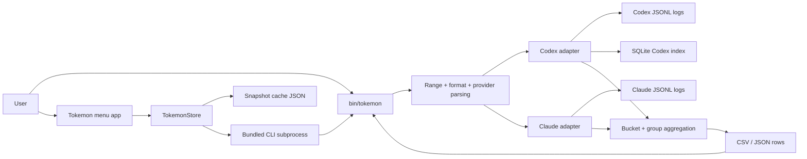

# Architecture Doc: Tokemon

**Last Updated**: 2026-03-07

**Status**: Complete

**Owners**: CLI tooling

**Related**:

- [`../tokemon/usage.md`](../tokemon/usage.md)
- [`../tokemon/spec.md`](../tokemon/spec.md)
- [`../tokemon-menuapp/usage.md`](../tokemon-menuapp/usage.md)

* * *

## 0. Context

### Purpose

Tokemon is a local token-usage reporting system with two user surfaces:

- the `bin/tokemon` Python CLI for shell-friendly CSV/JSON reports
- the `bin/tokemon-menuapp` macOS menu-bar app, which bundles the CLI and renders range charts

The system exists to answer "how many tokens did I use over a time range?" from local Codex and Claude logs without calling provider APIs or any network service.

* * *

## 1. Scope

### In Scope

- Local discovery of Codex and Claude session logs from the filesystem
- Provider-specific normalization into a shared usage record model
- Codex session replay reconciliation, incremental indexing, and bucketing
- CLI CSV/JSON output contracts used directly by users and by the menu app
- macOS menu-bar rendering, snapshot caching, and refresh behavior

### Out of Scope

- Provider-side billing or USD cost estimation
- Any cloud sync, remote APIs, or centralized telemetry backend
- Mutation of source logs or lifecycle management for Codex/Claude session files
- Cross-machine sharing of Tokemon state

* * *

## 2. System Boundaries and External Dependencies

### Boundary Definition

Tokemon owns local token-report generation and the menu-bar visualization path. It does not own the source logs themselves. Codex and Claude write JSONL logs independently; Tokemon only reads and derives reports from them.

### External Systems

| Dependency | Purpose | Failure Impact |
| --- | --- | --- |
| `~/.codex/sessions` and `~/.codex/archived_sessions` | Authoritative Codex token snapshots and session metadata | Codex usage becomes partial or unavailable |
| `~/.claude/projects` | Authoritative Claude assistant usage data | Claude usage becomes partial or unavailable |
| Local filesystem | Hosts source logs, derived SQLite index, and menu snapshot cache | Reads/writes fail; Tokemon falls back or shows stale/empty data |
| SQLite (`sqlite3`) | Incremental Codex snapshot index for warm-query speed | CLI falls back to raw Codex scans |
| macOS frameworks (`AppKit`, `SwiftUI`, `Charts`) | Menu-bar panel and chart rendering | Menu app cannot build or launch |
| System Python 3 | Runs the bundled Tokemon CLI inside the menu app | Menu app refresh fails with surfaced error text |

* * *

## 3. Architecture Overview

### High-Level Diagram (Required)



### Component Responsibilities

| Component | Responsibility | Key Interface |
| --- | --- | --- |
| `bin/tokemon` | Parse CLI args, resolve ranges, orchestrate provider reads, aggregate rows, emit CSV/JSON | `tokemon [range] [--sum-by ...] [--group-by ...] [--format ...] [--provider ...]` |
| Codex adapter in `bin/tokemon` | Discover files, scan cumulative snapshots, reconcile replayed session files, optionally persist derived snapshots in SQLite | `_codex_files`, `_scan_codex_file`, `_iter_codex_usage` |
| Claude adapter in `bin/tokemon` | Discover Claude logs and dedupe per assistant message | `_claude_files`, `_iter_claude_usage` |
| Aggregation/output layer in `bin/tokemon` | Bucket normalized usage records and serialize them to CSV/JSON | `_aggregate_rows`, `_write_csv`, `_write_json` |
| `apps/tokemon/TokemonMenuApp.swift` | Provide menu-bar UI, range selection, chart rendering, and refresh lifecycle | `TokemonStore`, `TokemonSnapshot`, `TokemonCommandRunner` |
| Snapshot cache | Preserve last successful app snapshots for stale-while-refresh behavior | `TokemonSnapshotCache` |
| Bundled app artifact | Freeze a copy of the CLI into the `.app` bundle | `bin/tokemon-menuapp` |

### Primary Flows

1. A user invokes `bin/tokemon` directly or opens the menu-bar app.
2. The CLI resolves the range window and provider selection, then discovers provider files.
3. Codex logs are read as cumulative snapshots and reconciled per logical session; Claude logs are deduped per assistant message.
4. Normalized records are bucketed and rendered as CSV/JSON.
5. In the menu app path, the bundled CLI JSON is transformed into chart buckets, cached locally, and rendered in an `NSPanel`.

* * *

## 4. Interfaces and Contracts

### Internal Interfaces

- CLI parser to report runner:
  - `_build_parser` and `_run_report` define the stable entrypoint and normalize `range`, `sum_by`, `group_by`, `format`, and `provider`.
- Codex adapter contract:
  - `session_meta.payload.id` identifies the logical session.
  - `event_msg.payload.type == "token_count"` carries cumulative `total_token_usage`.
  - Tokemon converts cumulative snapshots into usage deltas by keeping the highest totals seen for each logical session across files.
- Claude adapter contract:
  - `assistant` entries with `message.id` and `usage` are deduped by `(sessionId, message.id)`.
  - Field-wise maxima define the final usage for one assistant message.
- Menu app to CLI contract:
  - The app expects Tokemon JSON with `rows[].bucket` and `rows[].total_tokens`.
  - The app does not reimplement provider parsing in Swift.

### External Interfaces

- User-facing CLI:
  - stdout emits CSV by default or structured JSON with `provider`, `range`, `start`, `end_exclusive`, `sum_by`, `group_by`, and `rows`.
- Filesystem interfaces:
  - `TOKEMON_CODEX_SESSIONS_ROOT`
  - `TOKEMON_CODEX_ARCHIVED_ROOT`
  - `TOKEMON_CLAUDE_PROJECTS_ROOT`
  - `TOKEMON_INDEX_PATH`
  - `TOKEMON_DISABLE_INDEX`
  - `TOKEMON_MENUAPP_CACHE_PATH`
- Bundle interface:
  - `bin/tokemon-menuapp` copies `bin/tokemon` into the app bundle and the app executes it with `/usr/bin/python3`.

### Codex Log Format and Token Parsing

Tokemon treats Codex logs as newline-delimited JSON objects and reads them line by line. Parsing is intentionally selective:

- malformed JSON lines are skipped
- non-dict rows are skipped
- only two row families matter for Codex usage accounting:
  - `session_meta`
  - `event_msg` where `payload.type == "token_count"`

Relevant row shapes:

```json
{"type":"session_meta","payload":{"cwd":"/repo/path","id":"019cc581-ee8e-7692-9108-fab5633a5333"}}
{"timestamp":"2026-03-06T23:36:24.391Z","type":"event_msg","payload":{"type":"token_count","info":{"total_token_usage":{"input_tokens":36614,"cached_input_tokens":3456,"output_tokens":883,"reasoning_output_tokens":516,"total_tokens":37497}}}}
```

Exact parsing behavior:

1. `_iter_jsonl` reads one JSON object per line and drops malformed input.
2. `_parse_timestamp` accepts ISO timestamps, rewrites trailing `Z` to `+00:00`, and converts everything into local time.
3. `session_meta.payload.cwd` becomes the current workspace for subsequent Codex snapshots.
4. `session_meta.payload.id` becomes the logical session id. If missing, Tokemon falls back to the file stem.
5. For token rows, Tokemon reads `payload.info.total_token_usage`.
6. `_normalize_codex_totals` extracts exactly these five fields and clamps missing, invalid, or negative values to `0`:
   - `input_tokens`
   - `cached_input_tokens`
   - `output_tokens`
   - `reasoning_output_tokens`
   - `total_tokens`
7. `_scan_codex_file` stores each accepted token row as a `CodexSnapshot`, preserving the cumulative totals exactly as written by Codex.
8. `_iter_codex_usage_from_snapshots` sorts all snapshots by logical session and timestamp, then computes usage deltas from the highest totals already seen for that session.

Important semantic detail:

- Codex logs are cumulative, not per-event deltas. A `token_count` row reports the running total observed by Codex at that point in the session.
- Tokemon therefore cannot safely sum raw `total_token_usage.total_tokens` values directly.
- The SQLite index also stores cumulative snapshots, not pre-delta'd usage, so report windows can still be recomputed correctly after reload.

* * *

## 5. Data and State

### Source of Truth

The only authoritative usage state lives in the raw local provider logs:

- Codex: JSONL files under the Codex sessions and archived-session roots
- Claude: JSONL files under the Claude projects root

Everything else is derived:

- SQLite index: cached Codex snapshots plus file metadata
- Menu snapshot cache: cached chart-ready aggregates for one range at a time
- Bundled CLI inside the app: packaged copy of the CLI implementation

### Data Lifecycle

1. Tokemon discovers candidate source files from provider roots.
2. Codex files are scanned into `CodexSnapshot` values containing timestamp, workspace, session id, and cumulative token totals.
3. The Codex index stores those cumulative snapshots and rebuilds automatically when `PRAGMA user_version` does not match the current schema version.
4. Runtime report generation computes session-level deltas from the maximum prior totals seen for each logical session, then filters to the requested time window.
5. Claude files are scanned directly into deduped `UsageRecord` values.
6. Aggregation buckets records by time window and optional group key.
7. The menu app caches the last successful rendered snapshot per range, versioned separately from the CLI index.

### Consistency and Invariants

- Codex replay protection:
  - repeated files for the same `session_meta.payload.id` must not double count already-seen cumulative totals
- Codex index semantics:
  - the index stores cumulative snapshots, not precomputed deltas
- Claude dedupe:
  - one logical assistant message contributes at most one usage record
- Derived cache safety:
  - if the SQLite index is unavailable or invalid, Tokemon still computes from raw files
  - if the menu snapshot cache is invalid or stale-versioned, the app falls back to placeholders and refreshes
- Time semantics:
  - parsing, range resolution, and bucket assignment all happen in local time

### Replay Double-Count Bug and Current Fix

The bug we just fixed came from treating each Codex file as an independent cumulative stream.

What went wrong:

1. Codex can emit multiple `.jsonl` files for one logical session id.
2. Later files can replay earlier `token_count` history under fresh file timestamps.
3. The old Tokemon logic reset the "previous totals" baseline at each file boundary.
4. As a result, replayed cumulative snapshots were reinterpreted as brand-new usage, inflating weekly totals dramatically.

Example failure pattern:

- file A for session `S` ends at cumulative `11,000,000`
- file B for the same session `S` starts by replaying cumulative snapshots from `37,000` up through `11,000,000`
- if Tokemon resets state at file B, those replayed totals get counted again

Current fix:

1. `_scan_codex_file` no longer computes deltas inside one file.
2. Tokemon stores raw cumulative `CodexSnapshot` values first.
3. `_iter_codex_usage_from_snapshots` merges all candidate Codex snapshots across files.
4. The merge key is the logical session id from `session_meta.payload.id`.
5. For each session, Tokemon tracks the maximum totals seen so far and emits only the positive delta beyond that maximum.
6. `INDEX_SCHEMA_VERSION` forces old SQLite indexes to rebuild so stale pre-fix semantics are not reused.

The result is that resumed, snapshotted, or replayed Codex files still contribute new usage, but only for the portion of the cumulative totals that had not already been observed for that session.

* * *

## 6. Reliability, Failure Modes, and Observability

### Reliability Expectations

Tokemon is a best-effort local tool. Correctness and stable output matter more than strict latency guarantees, but the system is optimized for fast warm Codex queries and immediate stale snapshot display in the menu app.

### Failure Modes

- Provider log schema drift:
  - adapter normalization may undercount or skip records until the parser is updated
- SQLite failure or corruption:
  - `_connect_index` or indexed queries fail and the CLI falls back to raw scans
- Replayed Codex session files:
  - if not reconciled by session id, totals inflate; current architecture mitigates this with session-level max tracking
- Stale menu cache:
  - app may show stale values briefly while refresh runs; cache versioning prevents reuse across incompatible formats
- Missing bundled CLI or Python runtime:
  - menu refresh surfaces a user-visible error instead of silently failing
- Malformed JSONL lines or unreadable files:
  - lines are skipped best-effort to preserve overall report generation

### Observability

- Metrics: none built into Tokemon itself
- Logs: stderr for CLI validation/runtime errors; menu app surfaces refresh errors in the UI
- Traces: none
- Regression coverage: `tests/test_tokemon.py` and `tests/test_tokemon_menuapp.py`

* * *

## 7. Security and Compliance

- Authentication and authorization model:
  - none beyond local filesystem permissions; Tokemon is a single-user local tool
- Sensitive data handling:
  - Tokemon reads local workspace paths, session ids, and token counts
  - derived index and snapshot cache remain on the local machine
- Compliance or policy constraints:
  - no network transfer is required for Tokemon’s core reporting path
  - stdout/CSV/JSON output should still be treated as potentially sensitive because it reveals local workspace names and usage patterns

* * *

## 8. Key Decisions and Tradeoffs

| Decision | Chosen Option | Alternatives Considered | Rationale |
| --- | --- | --- | --- |
| Core implementation language | Single-file Python CLI | Multi-module package, Swift-only implementation | Fast iteration, easy local execution, simple packaging into the app bundle |
| Codex performance strategy | Persistent SQLite index of cumulative snapshots | Full raw scan every run, pre-aggregated daily totals | Keeps warm queries fast while preserving enough raw structure to recompute report windows correctly |
| Codex replay handling | Session-level reconciliation by `session_meta.payload.id` and max cumulative totals | Per-file deltas only, path-based dedupe | Codex emits overlapping files for one logical session; file-local deltas are not sufficient |
| Menu app integration | Swift UI shell that shells out to bundled CLI JSON | Reimplement providers and aggregation in Swift | Keeps one source of truth for token semantics and reduces divergence risk |
| App freshness model | Stale-while-refresh cached snapshots | Always-blocking refresh, no cache | Immediate reopen responsiveness without hiding refresh progress |
| Cache invalidation | Versioned SQLite schema and versioned menu snapshot file | Trust old derived state forever | Derived formats changed as Tokemon evolved; explicit versioning prevents stale semantics from persisting |

* * *

## 9. Evolution Plan

### Near-Term Changes

- Consolidate stale material in `docs/tokemon/spec.md` so it matches the current indexed architecture
- Add clearer provenance/debug output for which provider files or sessions dominate a report
- Consider exposing a CLI flag for diagnostic views of session replay reconciliation

### Long-Term Considerations

- Extract the Python core into a reusable library so the CLI and menu app packaging path are less tightly coupled to one script
- Add a plugin/provider abstraction if additional local AI clients are brought into Tokemon
- Introduce optional lightweight internal metrics or profiling output for large-history debugging

* * *

## 10. Risks and Open Questions

### Risks

- The system still depends on implicit provider log contracts; unannounced schema shifts can silently change results
- Cold scans over very large local histories remain expensive even with pruning and indexing
- The menu app and CLI can drift if the app bundle is not rebuilt after CLI-only changes
- Session-id-based replay reconciliation assumes Codex keeps logical session ids stable across continuation files

### Open Questions

1. Should Tokemon surface a first-class diagnostics mode that shows which session ids and files contributed to a large total?
2. Should the CLI keep the single-file architecture, or is the index/provider logic large enough now to justify a library split?
3. Should the app keep a bundled CLI, or would a shared embedded Python/runtime strategy reduce packaging drift?

* * *

## References

- `bin/tokemon`
- `apps/tokemon/TokemonMenuApp.swift`
- `bin/tokemon-menuapp`
- `docs/tokemon/usage.md`
- `docs/tokemon/spec.md`
- `docs/tokemon-menuapp/usage.md`
- `tests/test_tokemon.py`
- `tests/test_tokemon_menuapp.py`

## Manual Notes 

[keep this for the user to add notes. do not change between edits]

## Changelog
- 2026-03-07: Initial architecture doc for the current Tokemon CLI plus menu app implementation (`019cca49-d877-7e21-8bc9-88cbf7a15f14`)
- 2026-03-07: Added Codex log-format details, exact token parsing semantics, and the replay double-count bug explanation (`019cca49-d877-7e21-8bc9-88cbf7a15f14`)
